#решения задач из практики

#LeetCode 509

#LeetCode 70

#LeetCode 75
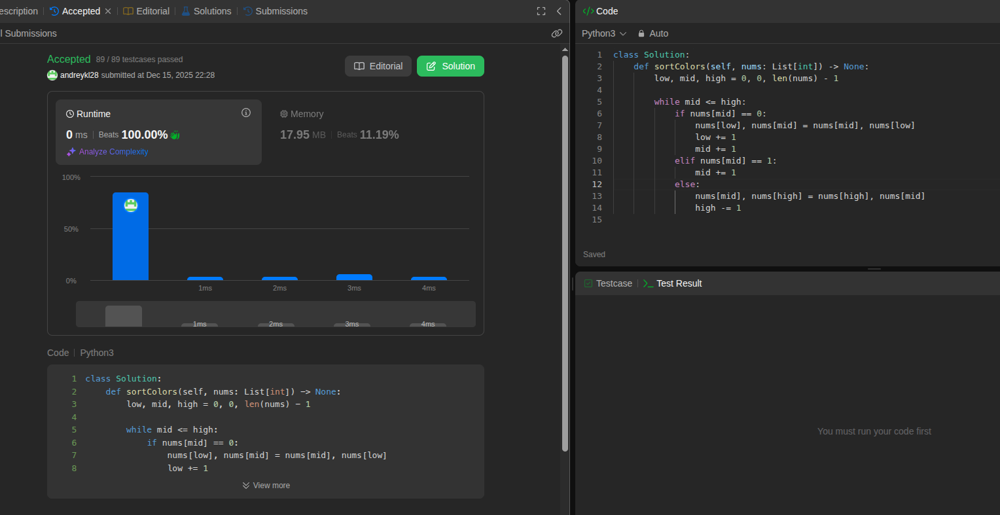

#Hackerrank CountingSort 1
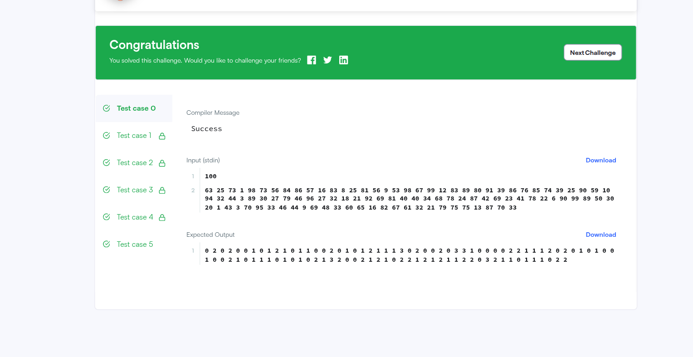
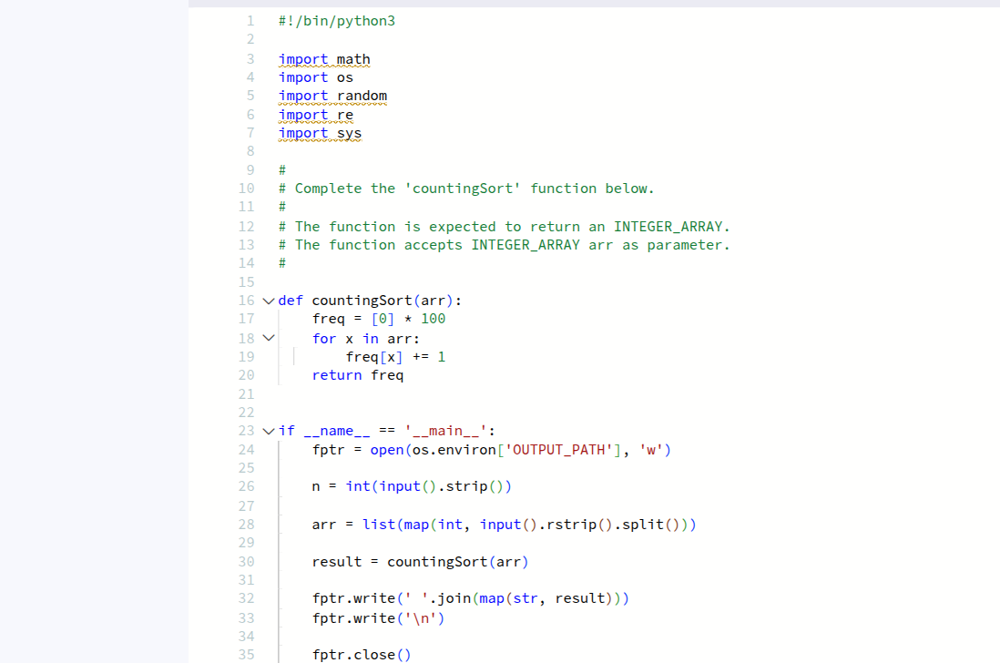

#Hackerrank CountingSort 2
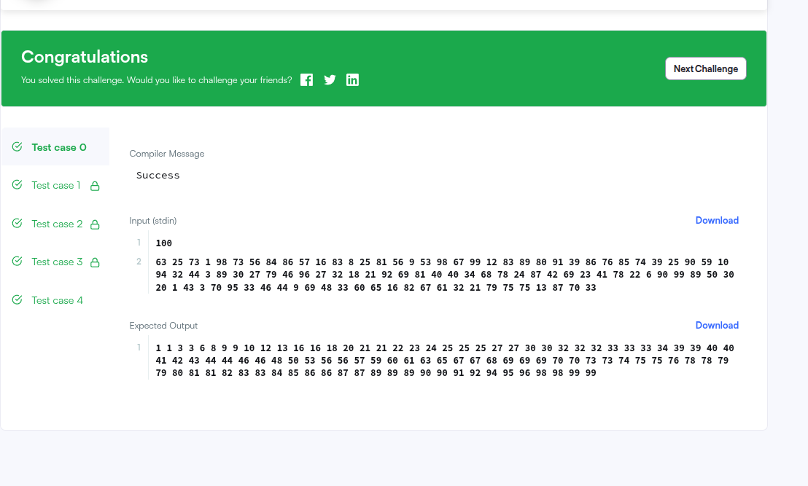
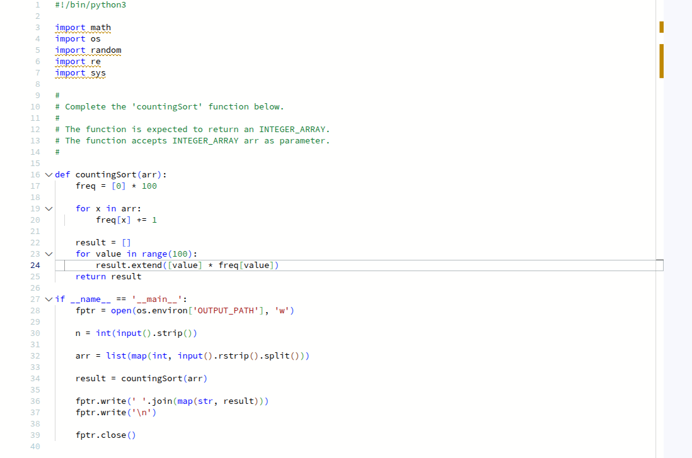

#Hackerrank CountingSort 3
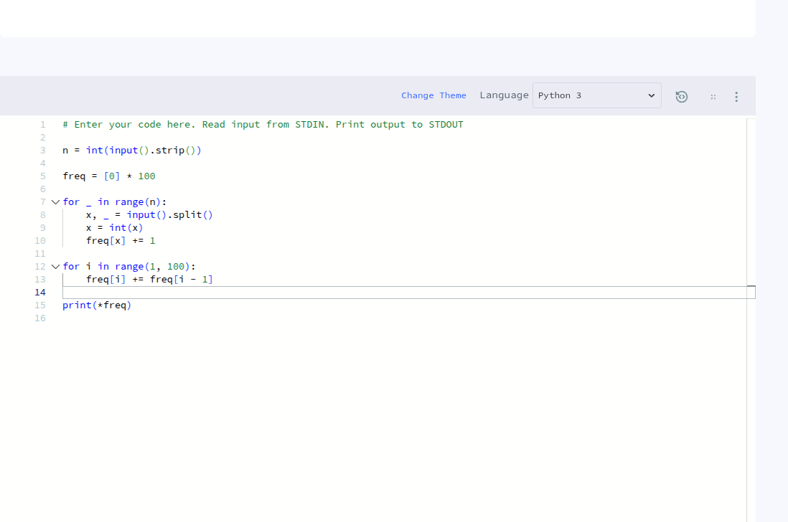
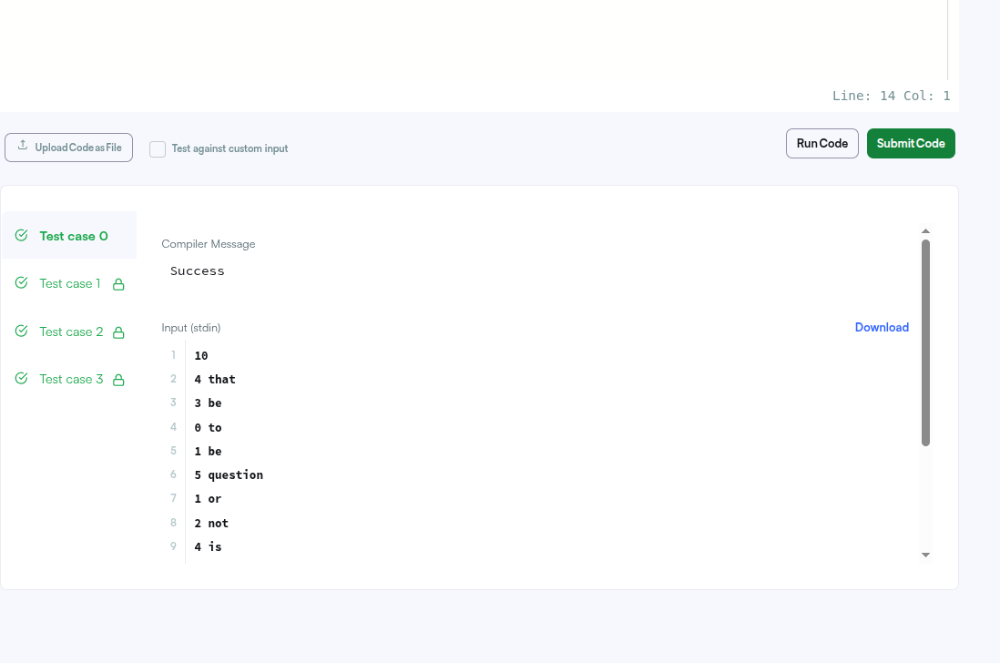

#Hackerrank QuickSort 1 
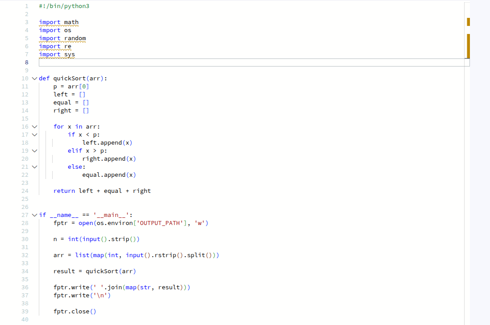
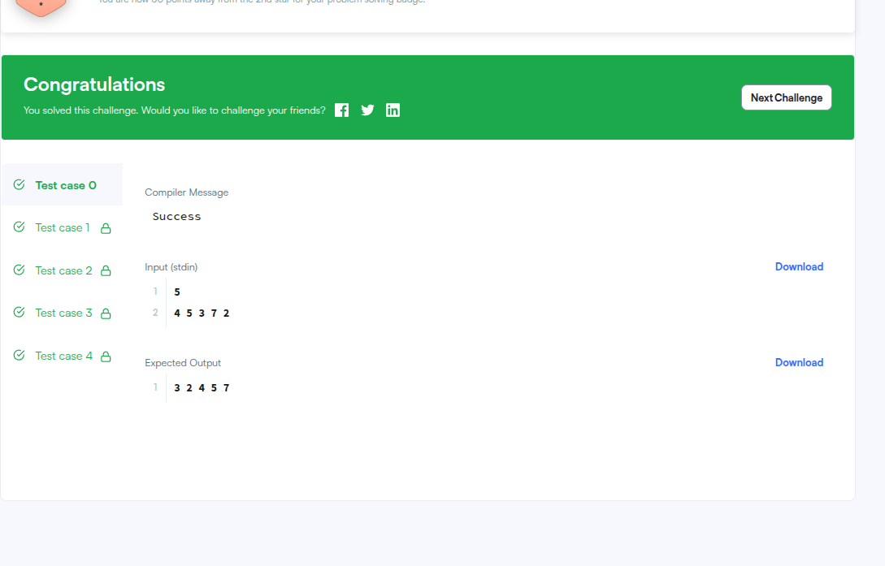

#Top K Frequent Elements
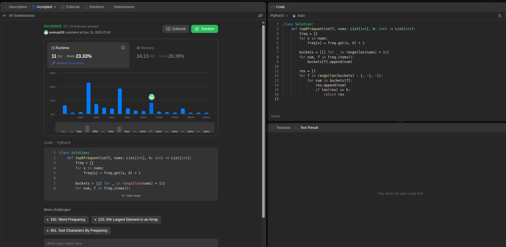

#K-th Largest Element in Array
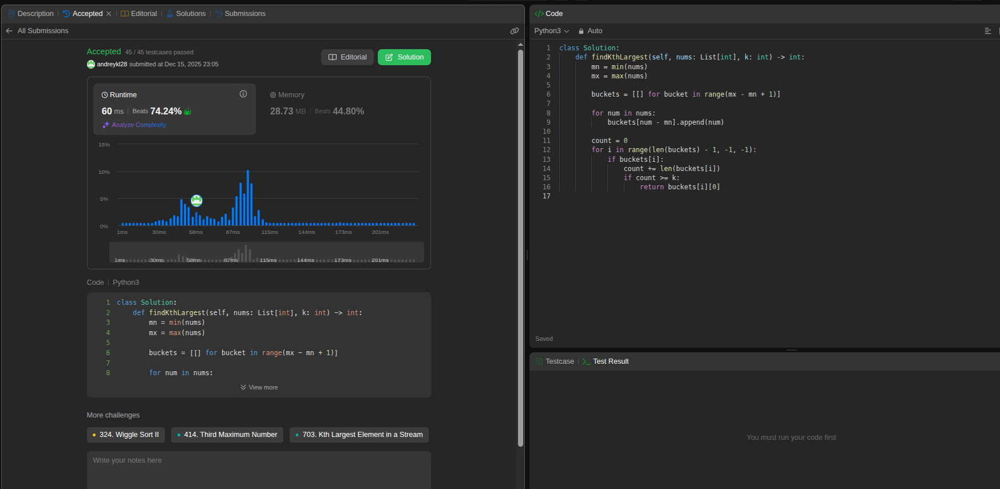

#LeetCode 20 Valid Parentheses
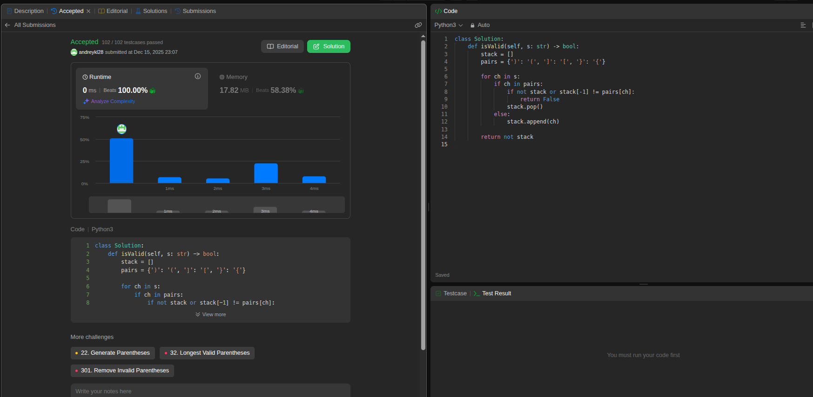

#LeetCode 225 Implement Stack using Queues
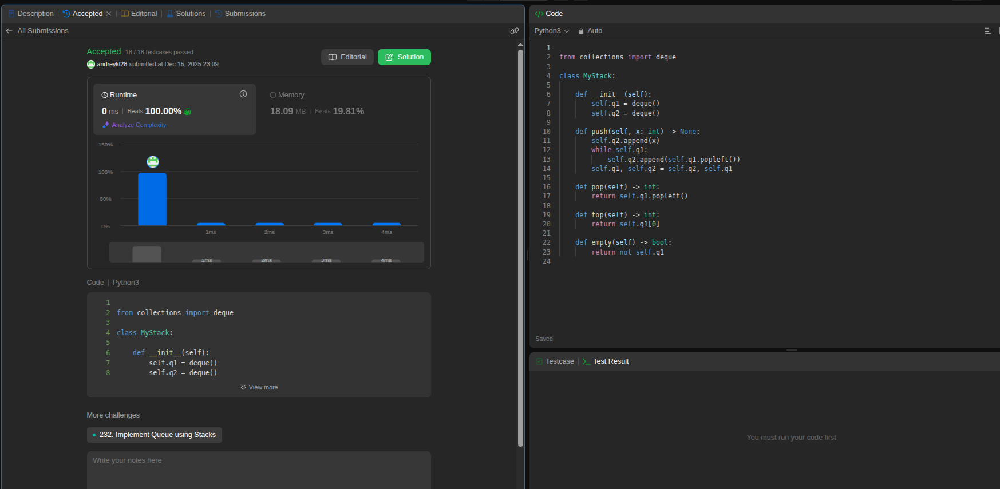

#LeetCode 232 Implement Queue using Stacks
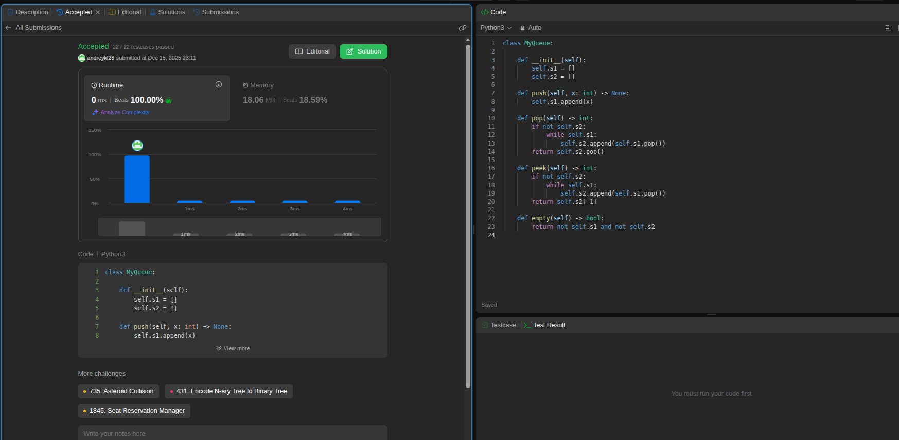